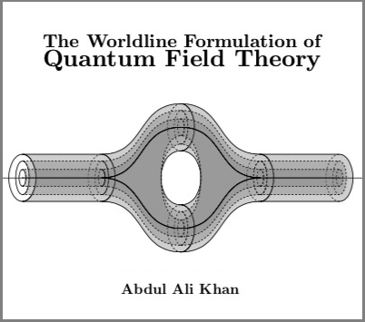

## [Click here to view my Master's Dissertation on the Worldline Formulation of Quantum Field Theory](./Worldline_Formalism.pdf).

### Supervised by [Professor Paul Mansfield](https://www.dur.ac.uk/research/directory/staff/?mode=staff&id=467)
#### In this work, I derive the form of Quantum Field Theory that emerges from the infinite tension limit of String Theory. This theory is equivalent to the mainstream 'second-quantized' formalism of QFT, but is distinct in many ways:
* It is a first-quantized theory.
* Supersymmetry exists on the worldlines.
* The Lagrangian is identical to that of 1D General Relativity.
* It is much more efficient to calculate certain kinds of amplitudes in this formalism.
* The amplitudes are gauge-invariant by construction.

#### In the dissertation, we will establish this theory from first principles, explore the above features and ultimately derive the Bern-Kosower Master Formulae for calculating amplitudes.
---
## [Click here to view my collection of solutions to problems in Theoretical Physics](./Theoretical_Physics.pdf).

#### Solutions to problems from various fields of Theoretical Physics. The questions are taken mainly from Cambridge Part III Problem Sets, Durham Problem Sets and 'An Introduction to Quantum Field Theory' by Peskin & Schroeder. The problems are from the following fields:
* Quantum Field Theory
* Advanced Quantum Field Theory
* Lie Algebras
* Standard Model
* Renormalization Group
* Amplitudes
* Conformal Field Theory
* General Relativity
* Cosmology
* String Theory
* Classical and Quantum Solitons

---
### Here is a video of me playing Subrahmanyan Chandrasekhar in a science documentary that aired on NHK (Japanese national television). 
<video width="320" height="240" controls>
  <source src="Chandra.mp4" type="video/mp4">
Your browser does not support the video tag.
</video>

